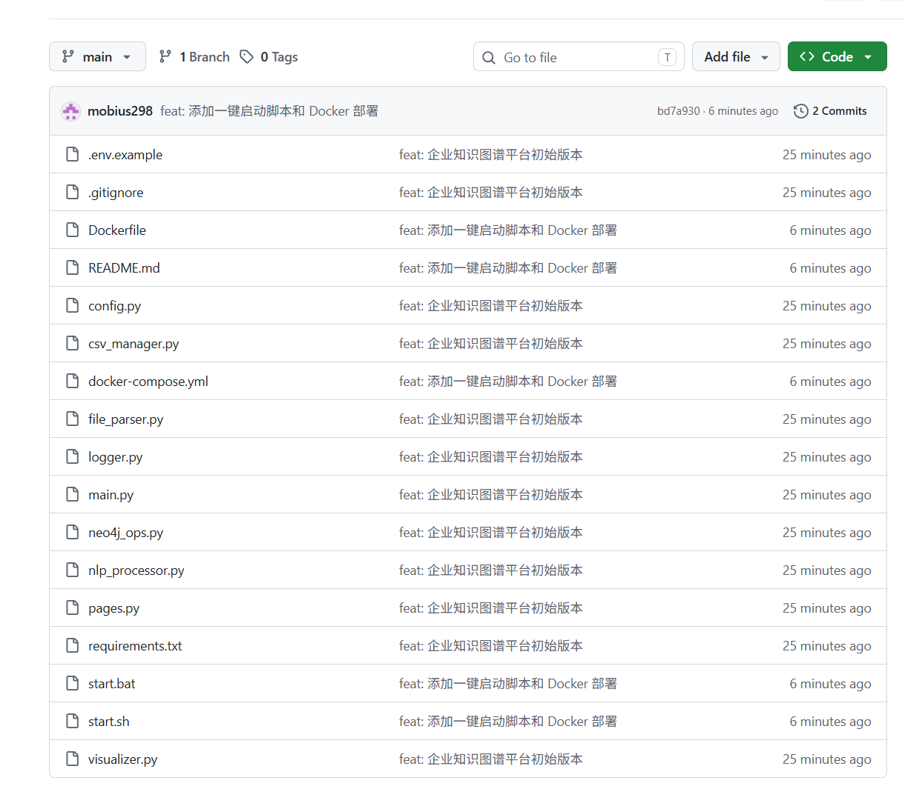

# 🏢 企业知识图谱平台

基于 **大语言模型（LLM）** 和 **Neo4j 图数据库** 的智能知识图谱构建与应用平台。

从非结构化文档中自动抽取实体关系三元组，构建可视化知识网络，支持关键词检索与图谱探索。

---

## ⚡ 三秒上手（Windows 用户）

> **下载 → 双击 → 用**，全程无需任何命令行操作。

### 第 1 步：下载项目



点击本页右上角绿色的 **`Code`** 按钮 → **`Download ZIP`**

下载完成后，把 ZIP 文件**解压**到任意文件夹（比如桌面）。

### 第 2 步：双击启动

进入解压后的文件夹，**双击 `start.bat`**。

脚本会自动：
- ✅ 检查 Python 环境
- ✅ 安装所需依赖
- ✅ 启动应用并打开浏览器

### 第 3 步：开始使用

浏览器会自动打开 `http://localhost:8501`。

在左侧菜单中：
- **文档上传** → 上传 TXT / PDF / DOCX，自动抽取知识
- **CSV 管理** → 查看、编辑抽取结果，生成导入脚本
- **图谱展示** → 查看交互式知识图谱（需先启动 Neo4j）

> 💡 **没有 API Key 也能用**：首次启动时脚本会自动创建 `.env`，把 `USE_MOCK_LLM=true` 保持默认即可体验模拟模式。

---

## 📋 环境要求

| 依赖 | 说明 |
|------|------|
| Python 3.9+ | [下载地址](https://www.python.org/downloads/)（安装时勾选 "Add Python to PATH"） |
| Neo4j 5.x（可选） | 用于图谱存储与可视化，[下载地址](https://neo4j.com/download/) |
| 通义千问 API Key（可选） | 用于真实 LLM 抽取，[申请地址](https://bailian.console.aliyun.com/) |

> 只体验文档抽取和 CSV 功能，**只需 Python**，无需 Neo4j 和 API Key。

---

## 🚀 其他启动方式

### Mac / Linux 用户

```bash
bash start.sh
```

### Docker 用户（一条命令启动 Neo4j + 应用）

```bash
docker-compose up -d
```

访问 `http://localhost:8501`。

停止：
```bash
docker-compose down
```

### 手动安装（开发者）

```bash
git clone https://github.com/mobius298/enterprise-kg-mobius298-v1.git
cd enterprise-kg-mobius298-v1
pip install -r requirements.txt
cp .env.example .env       # Windows 用 copy .env.example .env
streamlit run main.py
```

---

## ✨ 功能特性

- 📄 **多格式文档解析**：支持 TXT、PDF、DOCX
- 🤖 **AI 知识抽取**：基于通义千问自动抽取（实体1, 关系, 实体2）
- 📊 **CSV 中间层**：数据审查、备份、编辑，生成 Neo4j 导入脚本
- 💾 **Neo4j 存储**：幂等写入，支持增量更新
- 🗺️ **交互式可视化**：PyVis 动态图谱，支持拖拽/缩放/高亮
- 🔍 **关键词检索**：参数化查询，安全高效
- ⚡ **缓存机制**：数据哈希比对，避免重复渲染

---

## 📖 使用流程

```
上传文档 → 解析文本 → AI抽取三元组 → 保存CSV
    → 生成CQL脚本 → 导入Neo4j → 图谱可视化/知识检索
```

---

## 🏗️ 项目结构

```
enterprise-kg/
├── start.bat            # Windows 一键启动
├── start.sh             # Mac/Linux 一键启动
├── Dockerfile           # Docker 镜像构建
├── docker-compose.yml   # 一键启动 Neo4j + 应用
├── main.py              # 应用入口
├── pages.py             # 各功能页面
├── config.py            # 配置中心
├── logger.py            # 日志系统
├── file_parser.py       # 文件解析
├── nlp_processor.py     # LLM 知识抽取
├── csv_manager.py       # CSV 管理与 CQL 生成
├── neo4j_ops.py         # Neo4j 服务封装
├── visualizer.py        # 交互式可视化
├── requirements.txt
├── .env.example
└── .gitignore
```

---

## 🛠️ 技术栈

| 层次 | 技术 |
|------|------|
| 前端 | Streamlit |
| 图数据库 | Neo4j 5.x |
| 大语言模型 | 通义千问 (DashScope) |
| LLM 编排 | LangChain |
| 可视化 | NetworkX + PyVis |
| 文档解析 | PyPDF2, python-docx |

---

## ❓ 常见问题

<details>
<summary><b>1. 双击 start.bat 后闪退</b></summary>

可能是没装 Python。打开 CMD 输入 `python --version`，如果没有版本号，去 [python.org](https://www.python.org/downloads/) 下载安装，**安装时务必勾选 "Add Python to PATH"**。
</details>

<details>
<summary><b>2. 提示 pip 安装失败</b></summary>

手动运行：
```bash
pip install -r requirements.txt -i https://pypi.tuna.tsinghua.edu.cn/simple
```
</details>

<details>
<summary><b>3. 没有 API Key 怎么办</b></summary>

编辑 `.env` 文件，把 `USE_MOCK_LLM=false` 改为 `USE_MOCK_LLM=true`，系统会返回示例三元组用于演示。
</details>

<details>
<summary><b>4. 图谱展示页面空白</b></summary>

图谱功能需要 Neo4j 数据库支持。请先启动 Neo4j：
```bash
neo4j console
```
并在 `.env` 中填写正确的 `NEO4J_PASSWORD`。
</details>

---

## 📝 License

MIT License